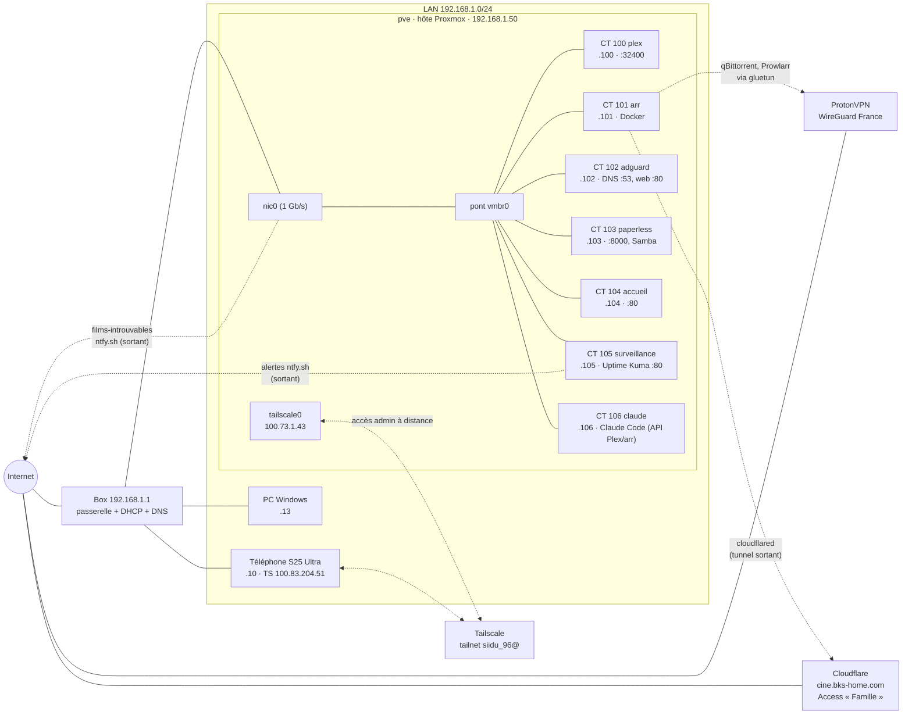
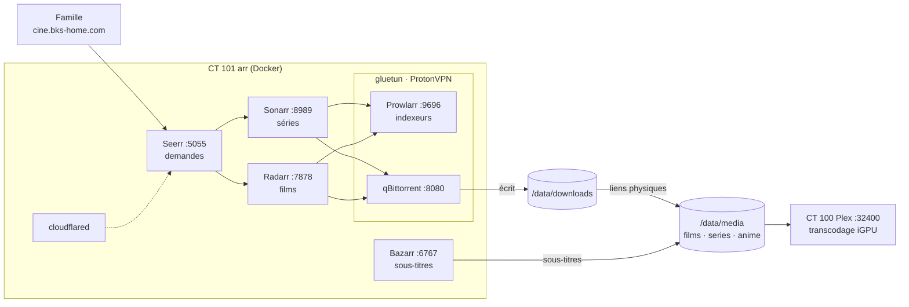
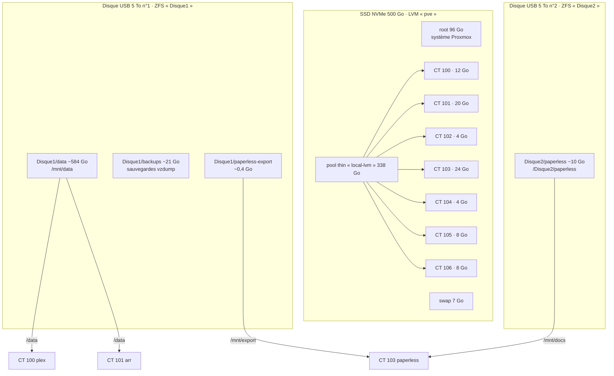
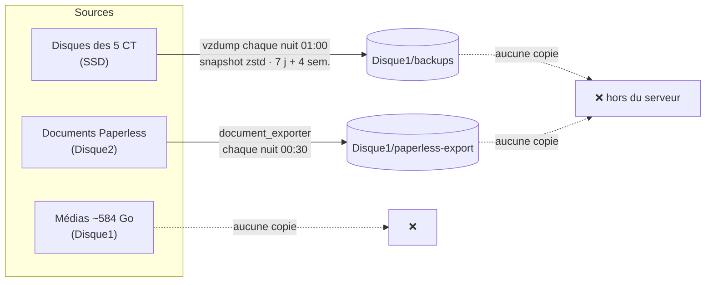

# Schémas

Schémas de l'infra en Mermaid : GitHub les affiche directement en image. Pour les modifier,
éditer le texte du bloc `mermaid` (aperçu possible sur https://mermaid.live).
Relevé du 7 octobre 2026.

## 1. Réseau

- Trait plein : réseau local. Pointillés : tunnels chiffrés, tous **sortants** (aucun port ouvert sur la box).
- Tailscale n'est que sur l'hôte : à distance on joint Proxmox, pas directement les CT.

## 2. Chaîne multimédia (CT 101 → CT 100)

`/data` = dataset ZFS `Disque1/data`, monté dans les CT 100 et 101.

## 3. Stockage

Chaque pool ZFS tient sur **un seul disque**, sans redondance. Voir [stockage.md](stockage.md).

## 4. Sauvegardes

Les points de montage (`/mnt/data`, `/mnt/docs`, `/mnt/export`) ne sont **pas** inclus dans vzdump.
Si le disque USB n°1 lâche, on perd les médias **et** toutes les sauvegardes. Voir [sauvegardes.md](sauvegardes.md).
